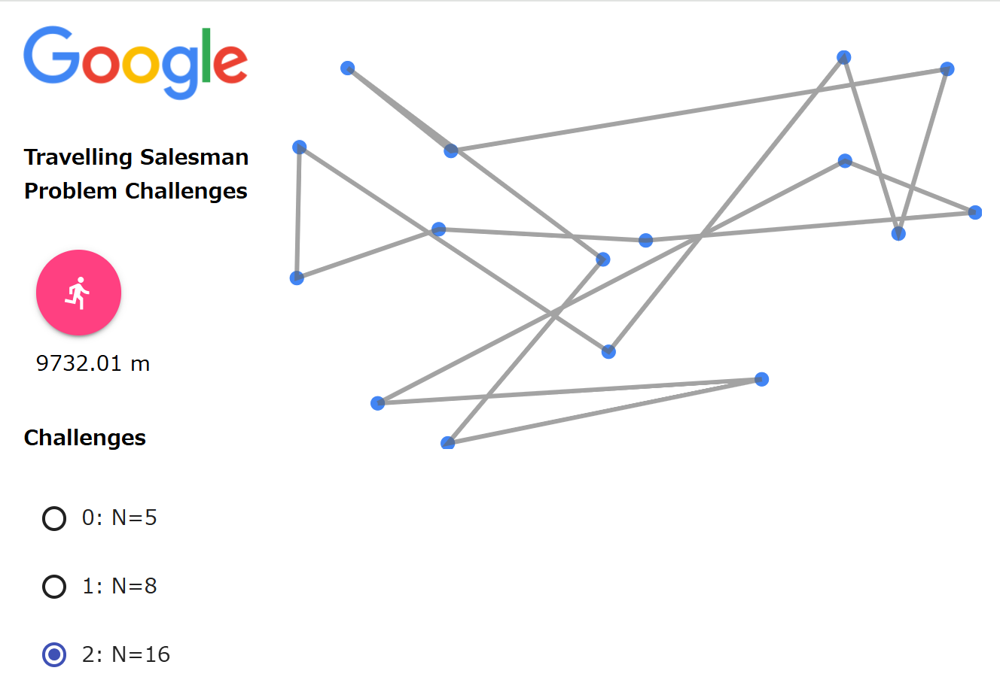
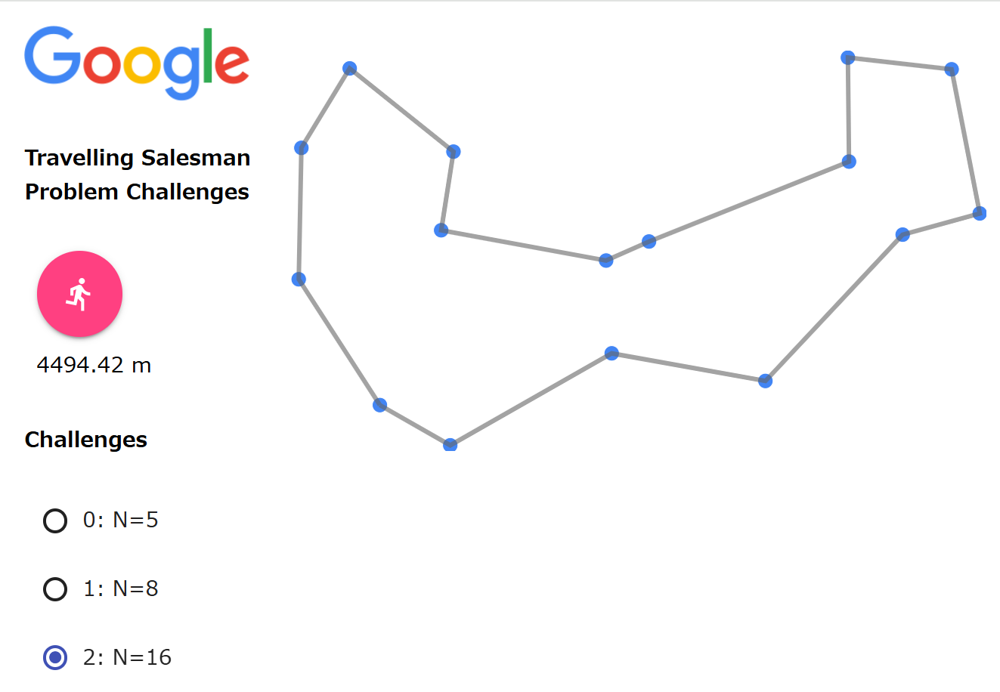

# Solution descriptions

### Very helpful universal optimization technique inspired by [Emmanual's blog][https://codecapsule.com/2010/04/06/simulated-annealing-traveling-salesman/]
- total distance does not need to be calculated everytime a swap is performed; would be much more efficient if only the swapped sections were compared

## solver_greedy_2-opt
- based on greedy approach already implemented, incorporated 2-opt to optimize possible entanglements in the designated route found by greedy algorithm
- 2-opt swap reverses the route between two given vertices, and checks if the routes could be shortened with this approach
- performs 2-opt swaps on every pair of vertices on the route to see if the route could be optimized

greedy-2-opt output:

## solver_random_2-opt
- instead of greedy, we make decisions randomly
random-2-opt output: 

## 焼きなまし法 / Simulated Annealing Heuristic

based on the idea from [Emmanuel's blog on simulted annealing and its application to traveling salesman problem](https://codecapsule.com/2010/04/06/simulated-annealing-traveling-salesman/)

- uses a concept of *temperature* to decide when to terminate optimization loop
- *temperature* is lowered each iteration by a multiplying to a *cooling_factor* 
- worth to note: a probability variable that keeps the possibility of keeping a longer new path
- cities list gets shuffled so the traversing direction is decided randomly
- for each iteration: 
  - swap two cities and see if new path is shorter
    - shorter: 100% new_path gets kept
    - not shorter: by certain probability new_path is kept
  - cool down temperature

## comparisons

| challenge No. | greedy_2opt                                                  | random_2opt                                                  | annealing                                                    |
| ------------- | ------------------------------------------------------------ | ------------------------------------------------------------ | ------------------------------------------------------------ |
| 2             |  |  |                                                              |
| 3             |                                                              |  |  |
|               |                                                              |                                                              |                                                              |

algorithm inspirations from Google STEP course materials

- 2.5 opt
- 3 opt
- 焼きなまし法
- 遺伝的アルゴリズム
- 蟻コロニー最適化

# Acknowledgements
## 2-opt
- The idea and workflow of 2-opt were learned from [Wikipedia](https://en.wikipedia.org/wiki/2-opt)
## Simulated Annealing
- Idea comes from [codeCapsule by Emmanuel Goossaert](https://codecapsule.com/2010/04/06/simulated-annealing-traveling-salesman/)

> PS D:\step\google-step-tsp> python .\output_verifier.py
Challenge 0
output          :    3291.62
sample/random   :    3862.20
sample/greedy   :    3418.10
sample/sa       :    3291.62

Challenge 1
output          :    5287.06
sample/random   :    6101.57
sample/greedy   :    3832.29
sample/sa       :    3778.72

Challenge 2
output          :    9732.01
sample/random   :   13479.25
sample/greedy   :    5449.44
sample/sa       :    4494.42

Challenge 3
output          :    9195.78
sample/random   :   47521.08
sample/greedy   :   10519.16
sample/sa       :    8150.91

Challenge 4
output          :   11511.53
sample/random   :   92719.14
sample/greedy   :   12684.06
sample/sa       :   10675.29

Challenge 5
output          :   22361.84
sample/random   :  347392.97
sample/greedy   :   25331.84
sample/sa       :   21119.55

Challenge 6
output          : 1374393.14
sample/random   : 1374393.14
sample/greedy   :   49892.05
sample/sa       :   44393.89